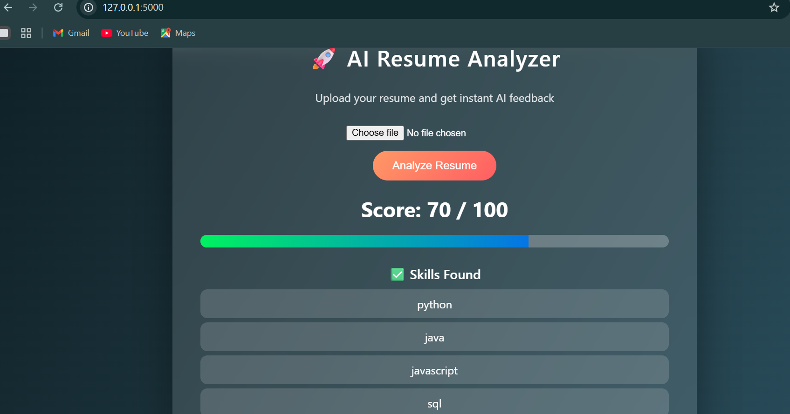

# 🚀 AI Resume Analyzer

An intelligent web application that analyzes resumes, extracts key skills, and provides an instant ATS-style score with improvement insights.

Built to help candidates evaluate and improve their resumes before applying for jobs.

---

## 🌟 Features

* 📄 Upload resume in PDF format
* 🧠 Automatic skill extraction
* 📊 Resume scoring system (0–100)
* ✅ Detected skills display
* ❌ Missing skills identification
* 🎨 Modern glassmorphism UI
* ⚡ Fast and lightweight Flask backend

---

## 📸 Demo / Screenshot

Below is the application in action:



---

## 🧩 How It Works

The system follows a keyword-based ATS simulation approach:

### 1️⃣ Resume Upload

User uploads a PDF resume via the web interface.

### 2️⃣ Text Extraction

Using **PyPDF2**, the backend extracts raw text from the resume.

### 3️⃣ Skill Matching Algorithm

* Resume text is converted to lowercase
* Compared against a predefined skills database
* Exact keyword matching is performed
* Matching skills are collected

### 4️⃣ Score Calculation

* Each detected skill = **10 points**
* Maximum score capped at **100**
* Missing skills computed using set difference

---

## 📊 Score Interpretation

| Score Range | Meaning                    |
| ----------- | -------------------------- |
| 0–40        | Needs major improvement    |
| 50–70       | Average resume             |
| 80–100      | Strong ATS-friendly resume |

---

## ⚙️ Prerequisites

Before running the project, ensure you have:

* Python **3.8 or higher**
* pip (Python package manager)
* Git (optional, for cloning)

Check Python version:

```bash
python --version
```

---

## 🚀 Installation & Setup

### 1️⃣ Clone the repository

```bash
git clone https://github.com/nupursingh10/ai-resume-analyzer.git
cd ai-resume-analyzer
```

### 2️⃣ Install dependencies

```bash
pip install -r requirements.txt
```

### 3️⃣ Run the application

```bash
python app.py
```

### 4️⃣ Open in browser

```
http://127.0.0.1:5000
```

---

## 🧪 Usage Guide

1. Launch the application
2. Upload your resume (PDF)
3. Click **Analyze Resume**
4. View:

   * Resume score
   * Skills detected
   * Missing skills

### ✅ Expected Input

* PDF resume
* Text-based (not scanned image)

### 📤 Expected Output

* Score out of 100
* Skills found list
* Missing skills list

---

## 🗂️ Project Structure

```
ai-resume-analyzer/
├── app.py              # Flask backend
├── templates/          # HTML files
├── static/             # CSS styling
├── screenshots/        # App images
└── requirements.txt    # Dependencies
```

---

## 🛠️ Tech Stack

**Frontend**

* HTML5
* CSS3

**Backend**

* Python
* Flask

**Libraries**

* PyPDF2 — PDF text extraction
* Flask — Web framework

---

## 🚀 Future Enhancements

* 🔥 ATS match with job description
* 🧠 NLP-based skill detection
* 📊 Resume improvement suggestions
* 🌐 Cloud deployment
* 🎯 Role-based scoring
* 📥 Downloadable analysis report

---

## 🤝 Contributing

Contributions are welcome!

If you'd like to improve this project:

1. Fork the repository
2. Create a new branch
3. Make your changes
4. Submit a pull request

For major changes, please open an issue first to discuss what you'd like to change.

---

## 👩‍💻 Author

**Nupur Singh**
Final Year BTech Student

If you like this project, consider giving it a ⭐ on GitHub!

---

## 📄 License

This project is licensed under the **MIT License** — feel free to use and modify for learning purpose.
